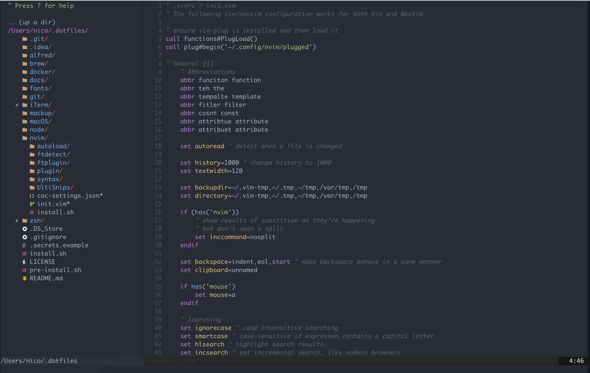
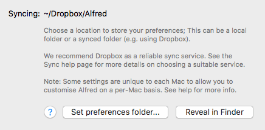

# Nico's dotfiles


Welcome to my world. This is an advanced developed macOS setup.

This setup works perfectly for JavaScript developers and Software
Architects who works with macOS.

If this particular setup doesn't work for you, please feel free to
borrow some ideas from it. Pull requests, comments, requests and any
other contributions are welcome.


## Contents

+ [Initial Setup and Installation](#initial-setup-and-installation)
+ [Update Installation modules](#update-installation-modules)
+ [Vim and Neovim Setup](#vim-and-neovim-setup)
+ [More about my deployment folder structure](#my-deployment-folder-structure)
+ [Alfred 4 Setup](#vim-and-neovim-setup)
+ [Setup ~/.secrets](#setup-secrets)


## Supports

- [Homebrew](https://brew.sh/index_de)
- [Docker](https://www.docker.com/)
- [Node.js](https://nodejs.org/en/)
- [Git](https://git-scm.com/)
- [Mackup](https://github.com/lra/mackup)
- [Vim](https://www.vim.org/) and [NeoVim](https://neovim.io/)
- [Oh-My-ZSH](https://github.com/ohmyzsh/ohmyzsh) or rather ZSH
- Deployment folder structure
- Mac Apps
  - [iTerm](https://www.iterm2.com/)
  - [Alfred 4](https://www.alfredapp.com/)

## Initial Setup and Installation

**Warning:** If you want to give these dotfiles a try, you should first
fork this repository, review the code, and remove things you don’t want
or need. Don’t blindly use my settings unless you know what theory do.
Use at your own risk!

You can install the repository by executing the command in terminal:

```bash
sh -c "`curl -fsSL https://raw.githubusercontent.com/snics/dotfiles/master/pre-install.sh`"
```

To run the install wizards please run the command in console:

```bash
sh ~/.dotfiles/install.sh
```

## Update Installation modules
An update installation Apps and modules is thankfully simple I have created an alias for it with which you can update everything. You just have to enter `update in terminal and everything will be updated``

## Vim and NeoVim Setup


vim and neovim should just work once the correct plugins are installed.
To install the plugins, you will need to open Neovim with following
command:

```
➜ nvim +PlugInstall
```

### Example of how Vim and NeoVim looks


## My deployment folder structure

This is my development folder structure, which you can also use. If you
have any ideas or suggestions for improvement, feel free to submit a
pull request!

The structure will be created by Install Wizard if you want to. I use
the folder structure as follows:

```bash
. ~/Projects    # Root folder for all development files
└── GitHub    # All the stuff that's on GitHub is in here.  
└── GitLab    # All the artwork on GitLab is in here.
└── Scripts   # I store scripts here that automate things or make my life easier every now and then.
└── Tools     # Here I save tools and tips that I am currently working on.
└── Learning  # My place to learn and try out new programming languages and things ;-)
└── Clients   # This is where all orders from customers come in. (You will be asked if you want this too!)
└── Startups  # This is the root order for all startups where I have shares and development tasks.
└── Talks     # Here are Project/Source Code or the Talks themselves from Talks/Meetup or from my work as a private lecturer
└── Throwaway # There's just things I want to look at, like from Github.

6 directory, 0 files
```

## Alfred 4 Setup

I have also provided my general Alfred 4 settings. You can find them
under directory `~/.dotfiles/alfred` there is a file with the name
`Alfred.alfredpreferences`. You have to import this file into Alfred,
more details can be found at
https://www.alfredapp.com/help/advanced/sync/

But here is a small step by step description:
1. Open folder with command `open ~/.dotfiles/alfred`.
2. Open Alfred 4 settings.
3. Go to Advanced.
4. Press button `Set preferences folder...`.



5. Select ~/.dotfiles/alfred directory.
6. Press set.
7. Restart Alfred 4.

## Setup ~/.secrets

In the file `~/.secrets` all secrets are set using a bash command. In
the `.secrets.example` inside the root directory of this project you can
find examples of what I set with this file. Please replace or add
commends to the file, after that you can create the file with the
command:

```bash
cp -f ~/.dotfiles/.secrets.example ~/.secrets
```

## TODOs:

- [ ] Remove custom helm settings and add asdf as default.
- [ ] Remove NVM settings and add asdf as default.
- [ ] Add settings for tmux.
- [ ] Add settings for Visual Studio Code.
- [ ] Add settings for Github Cloud IDEA.
- [ ] Add list of aliases.
- [ ] Add full list of Mac Apps.
- [ ] Add full list of all Vim and NeoVim shortcut.
- [ ] Fix problems with Alfred Github Workflow
- [ ] Add mackup default start settings for direkt using with out of own settings in the iCloud.
- [ ] Create pull requests for mackup applications that are not supported:
  - [ ] 1Password 7
  - [ ] BeardedSpice
  - [ ] Cardhop
  - [ ] CleanMyMac X
  - [ ] Clockify Desktop
  - [ ] Mountain Duck
  - [ ] coconutBattery 3
  - [ ] Fantastical 3
  - [ ] Gemini 2
  - [ ] Gifox
  - [ ] iStat Menus 6
  - [ ] JetBrains Toolbox
  - [ ] Mission Control Plus
  - [ ] MoneyMoney
  - [ ] Numi
  - [ ] OBS
  - [ ] Paw
  - [ ] Postman
  - [ ] React Native Debugger
  - [ ] Robo 3T
  - [ ] Sketch
  - [ ] Spark Mail App
  - [ ] The Unarchiver
  - [ ] Todoist
  - [ ] VirtualBox
  - [ ] zoom.us
  - [ ] SnippetsLab
  - [ ] SwitchResX
  - [ ] Kap
  - [ ] Final Cut Pro
  - [ ] Motion


## Feedback

Suggestions/improvements
[welcome](https://github.com/snics/dotfiles/issues)!

## Author

| [](http://twitter.com/NicoSwiatecki "Follow @NicoSwiatecki on Twitter") |
|:-----------------------------------------------------------------------------------------------------------------------------------------------------------------:|
| [Nico Swiatecki](https://swiatecki.io/)                                                                                                                           |

## Thanks to…

- [Mathias’s dotfiles](https://github.com/mathiasbynens/dotfiles) - Good Settings for macOS.
- [Nicknisi dotfiles](https://github.com/nicknisi/dotfiles) - Good settings for NeoVim.
- [Alfred Snippets - Git Commit Messages](https://github.com/apertureless/alfred-git-snippets) - I used for the default Alfred settings.
- [Homebrew and Cask for Alfred](https://github.com/fniephaus/alfred-homebrew) - I used for the default Alfred settings.
- [Image Optimization for Alfred](http://www.packal.org/workflow/image-optimization) - I used for the default Alfred settings.
- [Resize Image for Alfred](http://www.packal.org/workflow/resize-image) - I used for the default Alfred settings.
- [Caniuse for Alfred](https://github.com/willfarrell/alfred-caniuse-workflow) - I used for the default Alfred settings.
- [Font Awesome Workflow for Alfred](https://github.com/willfarrell/alfred-caniuse-workflow) - I used for the default Alfred settings.
- [Github Alfred Workflow](https://github.com/willfarrell/alfred-github-workflow) - I used for the default Alfred settings.
- [IP Alfred Workflow](http://www.packal.org/workflow/whats-my-ip) - I used for the default Alfred settings.
- [Faker Alfred Workflow](http://www.packal.org/workflow/alfred-faker) - I used for the default Alfred settings.
- [Copy URL Alfred Workflow](https://github.com/fallroot/copy-url-for-alfred) - I used for the default Alfred settings.
- [JetBrains Open project Alfred Workflow](https://github.com/bchatard/alfred-jetbrains) - I used for the default Alfred settings.
- [Spotify mini player Alfred Workflow](http://alfred-spotify-mini-player.com) - I used for the default Alfred settings.
