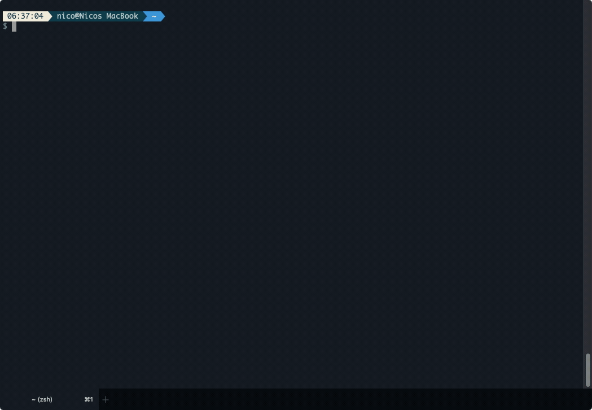
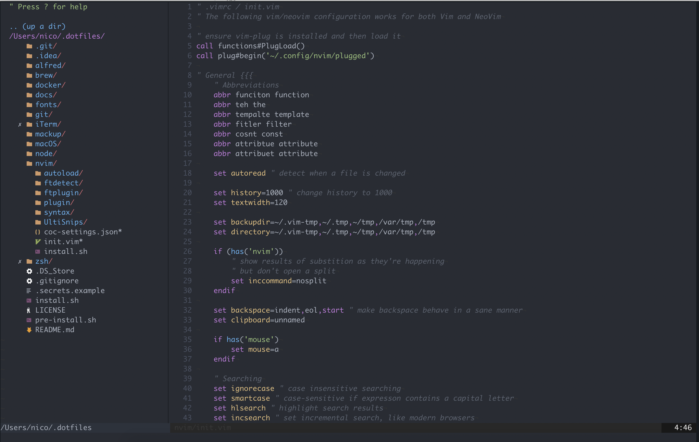

# Nico's dotfiles


Welcome to my world. This is an advanced macOS development setup optimized for modern software development.

This setup works perfectly for developers and software architects who work with macOS. If this particular setup doesn't work for you, please feel free to borrow some ideas from it. Pull requests, comments, requests, and any other contributions are welcome!

## 📋 Contents

- [✨ Features](#-features)
- [📦 What's Included](#-whats-included)
- [🚀 Quick Start](#-quick-start)
- [🐳 Try it with Docker](#-try-it-with-docker)
- [📁 Project Structure](#-project-structure)
- [⚙️ Configuration Details](#️-configuration-details)
- [🔄 Updates & Maintenance](#-updates--maintenance)
- [📝 Planning & Roadmap](#-planning--roadmap)
- [🤝 Contributing](#-contributing)
- [📄 License](#-license)
- [👤 Author](#-author)
- [🙏 Acknowledgments](#-acknowledgments)

## ✨ Features

- 🎨 Beautiful terminal setup with Ghostty and tmux
- 🔧 Comprehensive ZSH configuration with custom themes
- 📦 Automated installation and setup process
- 🎯 Version management with asdf
- 🎨 Catppuccin Mocha theme across all tools
- 📊 Advanced system monitoring with btop and k9s
- 🚀 Git workflow optimization with lazygit
- 🔐 Secure secrets management
- 🐳 Docker images for instant access (terminal, browser, full desktop)
- 📁 Organized project folder structure

## 📦 What's Included

### Core Tools
- 🍺 [Homebrew](https://brew.sh/) - Package manager for macOS with comprehensive Brewfile
  - 270+ packages, casks, and Mac App Store apps
  - Organized with taps for specialized tools
  - Automated installation and updates
- 🐚 [ZSH](https://www.zsh.org/) - Advanced shell configuration
  - Custom aliases and functions
  - Catppuccin Mocha syntax highlighting
  - Integration with bat, eza, and fzf
  - Optimized completion system
- 📝 [Neovim](https://neovim.io/) - Modern text editor configuration
  - Extensible plugin setup
  - Custom keybindings and workflows
  - Integrated with terminal tools
- 🔀 [Git](https://git-scm.com/) - Version control with custom configurations
  - Catppuccin theme integration
  - Git Delta for beautiful diffs
  - Git LFS support
  - GitHub CLI (gh) and GitLab CLI (glab)
- 🔧 [asdf](https://asdf-vm.com/) - Universal version manager
  - Node.js, Deno, Python, Rust
  - Kubernetes tools (kubectl, helm)
  - Unified version management
- 🐳 [Docker](https://www.docker.com/) - Container management
  - Docker Compose integration
  - Lazydocker for easy management
  - Container security tools (Trivy, Dockle)
- 🦭 [Podman](https://podman.io/) - Daemonless container engine
  - Drop-in replacement for Docker
  - Rootless containers
  - Podman Compose for Docker Compose compatibility
  - Podman Desktop for GUI management

### Terminal & CLI Tools
- 👻 [Ghostty](https://ghostty.org/) - Modern, fast terminal emulator
  - GPU-accelerated rendering
  - Catppuccin Mocha theme support
- 🖥️ [tmux](https://github.com/tmux/tmux) - Terminal multiplexer
  - Custom keybindings and workflows
  - Plugin manager integration
  - Catppuccin theme configuration
  - Session management with sesh
- 🦇 [bat](https://github.com/sharkdp/bat) - Enhanced cat with syntax highlighting
  - Git integration
  - Custom themes
- 🌳 [eza](https://github.com/eza-community/eza) - Modern, colorful ls replacement
  - File type icons
  - Git status integration
- 🔍 [fzf](https://github.com/junegunn/fzf) - Fuzzy finder for command-line
  - ZSH integration
  - File and history search
- 📊 [btop](https://github.com/aristocratos/btop) - Beautiful resource monitor
  - CPU, memory, disk, network stats
  - Process management
  - Catppuccin Mocha theme
- 🎮 [k9s](https://k9scli.io/) - Kubernetes CLI manager
  - Real-time cluster monitoring
  - Pod and container management
  - Log viewing and resource editing
- 🦎 [lazygit](https://github.com/jesseduffield/lazygit) - Simple terminal UI for git
  - Visual git workflow
  - 14 Catppuccin color variants included
  - Interactive staging and commits
- 🐳 [lazydocker](https://github.com/jesseduffield/lazydocker) - Simple Docker/container TUI
  - Container and image management
  - Real-time stats and logs
- 🚀 [starship](https://starship.rs/) - Minimal, fast, customizable shell prompt
  - Cross-shell compatibility
  - Rich status information
- 🔎 [ripgrep](https://github.com/BurntSushi/ripgrep) - Ultra-fast recursive search tool
- 🔍 [fd](https://github.com/sharkdp/fd) - Fast, user-friendly alternative to find
- 🌐 [glow](https://github.com/charmbracelet/glow) - Render markdown in the terminal
- 📚 [tldr](https://tldr.sh/) - Simplified, practical man pages
- 🗑️ [trash](https://hasseg.org/trash/) - Move files to macOS Trash from CLI
- 🔄 [zoxide](https://github.com/ajeetdsouza/zoxide) - Smarter cd command
- 🎯 [direnv](https://direnv.net/) - Environment switcher for the shell

### Development Tools & Languages
- 🔧 [asdf](https://asdf-vm.com/) - Universal version manager (see Core Tools)
  - Manages multiple language runtimes
  - Plugin-based architecture
  - Configured plugins: Node.js, Deno, Python, Rust, kubectl, helm
- 📦 [Node.js](https://nodejs.org/) - JavaScript runtime
  - Managed via asdf
  - npm, yarn, and pnpm support
- 🦕 [Deno](https://deno.land/) - Secure JavaScript/TypeScript runtime
- 🦀 [Rust](https://www.rust-lang.org/) - Systems programming language
  - Rustup toolchain manager
  - Cargo package manager
- 🐹 [Go](https://golang.org/) - Go programming language
  - gopls language server
  - delve debugger
  - gox for cross-compilation
- 🐍 [Python](https://www.python.org/) - Python 3.11+
  - Managed via asdf and Homebrew
- ⚡ [Swift](https://swift.org/) - Apple's programming language

### Kubernetes & DevOps Tools
- ☸️ [kubectl](https://kubernetes.io/) - Kubernetes command-line tool
  - Cluster management and deployment
- 📦 [Helm](https://helm.sh/) - Kubernetes package manager
- 🔍 [k9s](https://k9scli.io/) - Kubernetes CLI manager (see Terminal Tools)
- 🚢 [kind](https://kind.sigs.k8s.io/) - Kubernetes in Docker
- 🎯 [minikube](https://minikube.sigs.k8s.io/) - Local Kubernetes
- 🧊 [kubectx](https://github.com/ahmetb/kubectx) - Fast context/namespace switching
- 🔒 [kubeseal](https://github.com/bitnami-labs/sealed-secrets) - Sealed Secrets
- 🔎 [kubescape](https://github.com/kubescape/kubescape) - Security posture management
- 🕵️ [kubeshark](https://kubeshark.co/) - API traffic viewer
- 🐋 [Docker](https://www.docker.com/) - Container platform
- 🦭 [Podman](https://podman.io/) - Daemonless container engine
- 🌌 [OrbStack](https://orbstack.dev/) - Fast, lightweight containers & VMs for macOS
- 🔧 [Terraform](https://www.terraform.io/) - Infrastructure as Code
- 🏗️ [OpenTofu](https://opentofu.org/) - Open-source Terraform alternative
  - Drop-in replacement for Terraform
  - Community-driven infrastructure as code
- 📜 [Ansible](https://www.ansible.com/) - Automation and configuration management
- 🔒 [Trivy](https://github.com/aquasecurity/trivy) - Container security scanner
- 🐶 [Dockle](https://github.com/goodwithtech/dockle) - Container image linter
- 🔍 [Dive](https://github.com/wagoodman/dive) - Docker image exploration tool
  - Layer content analysis
  - Image size optimization
- 📋 [Hadolint](https://github.com/hadolint/hadolint) - Dockerfile linter
  - Best practice validation
  - Inline bash checking
- 📦 [Skopeo](https://github.com/containers/skopeo) - Container image operations tool
  - Image copying and inspection
  - Registry management

### Productivity & Apps
- 💾 [Mackup](https://github.com/lra/mackup) - Application settings backup and sync
- 📓 [Obsidian](https://obsidian.md/) - Powerful knowledge base
  - Markdown-based note-taking
  - Second Brain / PARA methodology
  - iCloud sync for macOS and iOS
  - Full configuration automation (in progress)
- 🔐 [1Password](https://1password.com/) - Password manager
  - CLI integration included
- 🎨 [Cursor](https://www.cursor.com/) - AI-powered code editor
- 🌐 [Arc Browser](https://arc.net/) - Modern, feature-rich browser
- 💬 [Raycast](https://www.raycast.com/) - Extendable launcher and productivity tool
- 📊 [Linear](https://linear.app/) - Project management for software teams
- 💼 [Notion](https://www.notion.so/) - All-in-one workspace
- 📅 [Notion Calendar](https://www.notion.so/calendar) - Calendar integration
- 🎬 [CleanShot](https://cleanshot.com/) - Advanced screenshot and recording tool

### Additional Tools & Utilities
The [`brew/Brewfile`](brew/Brewfile) contains 270+ additional packages including:
- 🔒 Security tools (nmap, hydra, wireshark, gpg)
- 🎥 Media tools (ffmpeg, imagemagick, obs)
- 🗂️ File utilities (p7zip, unarchiver, tree)
- 🌐 Network tools (wget, curl, ssh)
- 📝 Documentation tools (pandoc, texlive)
- ⌨️ Custom keyboard firmware (QMK, Vial)
- And many more specialized tools...

## 🚀 Quick Start

### Prerequisites

- macOS (tested on latest versions)
- Command Line Tools for Xcode
- Internet connection

### Installation

**⚠️ Warning:** If you want to give these dotfiles a try, you should first fork this repository, review the code, and remove things you don't want or need. Don't blindly use my settings unless you know what they do. Use at your own risk!

#### Step 1: Clone and Pre-install

Run this command in your terminal to download and prepare the dotfiles:

```bash
sh -c "`curl -fsSL https://raw.githubusercontent.com/snics/dotfiles/master/pre-install.sh`"
```

#### Step 2: Run Installation Wizard

To run the install wizard, execute:

```bash
sh ~/.dotfiles/install.sh
```

The wizard will guide you through the installation process and let you choose which components to install.

## 🐳 Try it with Docker

Don't want to install anything on your machine? The entire development environment
is available as layered Docker images. Try NeoVim, the full CLI toolchain, or even
a complete Linux desktop — right from your terminal or browser.

```
debian:bookworm-slim
  └── snic/nvim                          NeoVim + 77 plugins + LSPs
       └── snic/devenv                   + zsh, tmux, starship, lazygit, 330+ tools
            ├── snic/devenv-web-terminal  + browser terminal (ttyd)
            └── snic/devenv-web-desktop   + full XFCE4 desktop in the browser
```

```bash
# NeoVim with all plugins and LSPs — open any project
docker run -it --rm -v "$(pwd):/home/developer" snic/nvim

# Full dev environment — zsh + tmux + starship + lazygit + all CLI tools
docker run -it --rm -v "$(pwd):/home/developer/workspace" snic/devenv

# Terminal in the browser (http://localhost:7681)
docker run --rm -p 7681:7681 snic/devenv-web-terminal

# tmux in the browser
docker run --rm -p 7681:7681 -e TTYD_MODE=tmux snic/devenv-web-terminal

# NeoVim in the browser
docker run --rm -p 7681:7681 -e TTYD_MODE=nvim snic/devenv-web-terminal

# Full Linux desktop in the browser (http://localhost:3000)
docker run --rm -p 3000:3000 --shm-size=256m snic/devenv-web-desktop
```

All images support `linux/amd64` and `linux/arm64`. See [`_images/README.md`](_images/README.md) for details.

## 📁 Project Structure

This dotfiles repository uses the following structure:

```
~/.dotfiles/
├── _install/          # Installation scripts for individual tools
├── asdf/              # asdf version manager configuration
├── brew/              # Homebrew bundle file
├── docs/              # Documentation and screenshots
├── ghostty/           # Ghostty terminal configuration
├── git/               # Git configuration and themes
├── k9s/               # Kubernetes CLI configuration
├── lazygit/           # Lazygit themes and settings
├── macOS/             # macOS-specific settings and scripts
├── nvim/              # Neovim configuration
├── obsidian/          # Obsidian settings
├── planning/          # Project planning and roadmap
├── tmux/              # tmux configuration and plugins
├── zsh/               # ZSH configuration, themes, and functions
├── install.sh         # Main installation script
└── pre-install.sh     # Pre-installation setup
```

### My Development Folder Structure

I use a well-organized folder structure for all development work. The installation wizard can optionally create this structure for you:

```bash
~/Projects/           # Root folder for all development
├── GitHub/           # GitHub repositories
├── GitLab/           # GitLab repositories
├── Scripts/          # Automation scripts and utilities
├── Tools/            # Tools and utilities in development
├── Learning/         # Learning projects and experiments
├── Clients/          # Client projects (optional)
├── Startups/         # Startup projects (optional)
├── Non-Profit/       # Non-profit organization projects (optional)
├── Talks/            # Presentations and talk materials (optional)
├── Workshop/         # Workshop materials and projects (optional)
└── Throwaway/        # Temporary projects and experiments
```

## ⚙️ Configuration Details

### Neovim Setup



Neovim should work out of the box once the correct plugins are installed. To install the plugins, open Neovim with:

```bash
nvim +PlugInstall
```



### Setup ~/.secrets

For sensitive information like API keys and tokens, create a `~/.secrets` file. An example template is provided:

```bash
cp -f ~/.dotfiles/.secrets.example ~/.secrets
```

Edit the file and add your secrets:

```bash
vim ~/.secrets
```

The `.secrets` file is sourced by ZSH and should contain bash-compatible environment variable exports.

### Customizing the Setup

Each configuration directory contains settings for its respective tool. Feel free to customize:

- **ZSH**: Edit files in `zsh/settings/`
- **Git**: Modify `git/catppuccin.gitconfig`
- **tmux**: Adjust `tmux/.config/tmux/tmux.conf`
- **Ghostty**: Configure `ghostty/` settings

## 🔄 Updates & Maintenance

Updating your installed applications and tools is simple! I've created a convenient alias that updates everything at once:

```bash
update
```

This command will:
- Update Homebrew and all installed packages
- Update ZSH plugins
- Update asdf plugins and tool versions
- Perform system maintenance tasks

You can find the implementation in `zsh/settings/functions/update.zsh`.

## 📝 Planning & Roadmap

I maintain a structured planning system for future improvements and features. Check out the [`planning/`](planning/) directory for:

- **Roadmap**: High-level plans and timeline
- **Backlog**: Ideas and future enhancements
- **In Progress**: Currently working on features

Feel free to suggest new features or improvements by opening an issue!

### What's Next

Some planned improvements include:
- **Obsidian Second Brain Setup** - Complete automation with templates, plugins, and PARA methodology
- Further automation of the installation process
- Additional tool integrations
- Enhanced documentation
- More themes and customization options

See the full roadmap in [`planning/backlog.md`](planning/backlog.md) for details.

## 🤝 Contributing

Suggestions and improvements are [welcome](https://github.com/snics/dotfiles/issues)!

If you'd like to contribute:
1. Fork this repository
2. Create your feature branch (`git checkout -b feature/amazing-feature`)
3. Commit your changes using emojis (`git commit -m '✨ Add some amazing feature'`)
4. Push to the branch (`git push origin feature/amazing-feature`)
5. Open a Pull Request

### Commit Conventions

This project uses emojis in commit messages for better readability:

- ✨ New feature or major addition
- 📝 Documentation updates
- 🔧 Configuration changes
- ♻️ Refactoring or code cleanup
- 🐛 Bug fixes
- 🔥 Removing code or files
- 🎨 Styling or UI improvements
- ⚡ Performance improvements
- 🚀 Deployment or release changes

### Recent Contributions

- 📝 Update license to MIT (Nov 2024)
- ♻️ Remove PHP and Kotlin from setup (Nov 2024)
- ✨ Add Non-Profit and Workshop folders to project structure (Nov 2024)
- 📝 Restructure README with improved organization (Nov 2024)
- ✨ Create planning system with backlog and roadmap (Nov 2024)

## 📄 License

This project is licensed under the MIT License - see the [LICENSE](LICENSE) file for details.

Feel free to use, modify, and share these dotfiles as you wish!

## 👤 Author

| [](https://www.linkedin.com/in/nico-swiatecki/ "Connect with Nico Swiatecki on LinkedIn") |
| :-----------------------------------------------------------------------------------------------------------------------------------------------------------------------------------: |
|                                                                    **Nico Swiatecki**                                                                     |

## 🙏 Acknowledgments

This dotfiles repository was inspired by and borrows ideas from many amazing developers:

### Dotfiles Inspiration
- [Mathias Bynens' dotfiles](https://github.com/mathiasbynens/dotfiles) - Excellent macOS settings
- [Nick Nisi's dotfiles](https://github.com/nicknisi/dotfiles) - Great Neovim configuration
